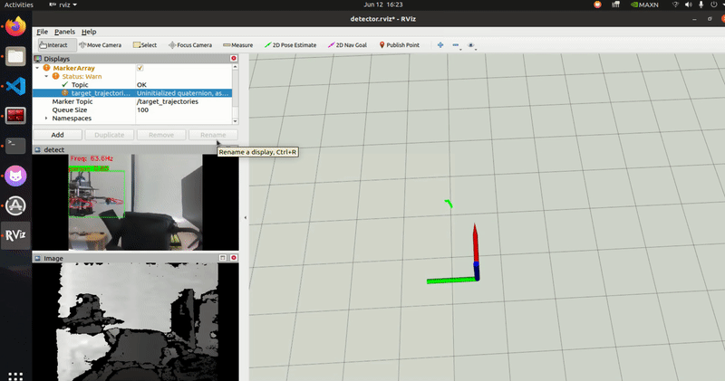
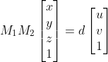

# YOLO-Detection


<div align="center">
  
</div>
使用YOLO通过RBG图和深度图获得目标位置的三维位置

## 思路
利用YOLO，获得目标的BBOX。通过投影到深度图的对应位置，获取深度图，利用坐标转换，获得目标的空间位置。
<div align="center">
  
</div>


<div align="center">
  
</div>

## YOLO 识别
<div align="center">
  
</div>

**YOLO部分使用[tensorrt](https://github.com/HNU-CAT/yolov11_tensorrt_ros)加速**，数据集为新飞机自采2000张照片。

## 坐标转换
<div align="center">
  
</div>


**检测部分参考[onboard-detect](https://github.com/Zhefan-Xu/onboard_detector)，使用MAD计算BBOX中的深度，从而获得更好的效果。** 目前精度还未准确的测量。


## 主要特点
- 基于YOLOv11的实时目标检测
- 利用TensorRT加速推理过程
- 结合深度图计算目标的三维空间位置
- 使用MAD算法优化深度计算精度

## 使用方法

### YOLO部分
使用训练好的权重，参考[tensorrt](https://github.com/HNU-CAT/yolov11_tensorrt_ros)加速，在`cfg`文件中设置好对应的参数和文件目录

```
roslaunch yolo_detector_node detector.launch 

```
### 坐标检测部分

修改`d2p/config/detector_params.yaml`里边的参数，对应正确的ROS话题、相机参数、变换矩阵等

终端一：
```
roslaunch d2p rviz.launch 
```

终端二：
```
roslaunch d2p d2p.launch
```